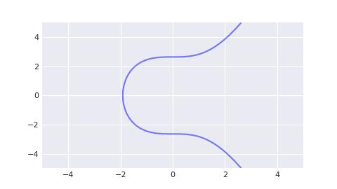

# Solana/Private Key, Public Key and Address/A Cryptographic Explanation of Private Key (Part 2)

Before diving into the private key used in Solana, we first need to understand a concept widely applied in modern information security known as "public-private key cryptography". This is not only the cornerstone for Solana's security but also forms the basis of its operations. Public-private key cryptography, or asymmetric encryption, is an encryption method based on mathematical algorithms that uses two keys: a public key and a private key.

**Public Key**

- The public key is an open key that can be widely distributed. Its main function is to encrypt data or verify signatures.
- With the public key in hand, others can safely encrypt messages or authenticate your data.

**Private Key**

- The private key is a securely held key that you alone possess. Its primary role is to decrypt information or create signatures.
- If someone uses your public key to encrypt a message, only you can use your private key to decode it and read the content.

The mathematical foundation of public-private key cryptography traces back to the 1970s. One of the earliest attempts was the "Diffie-Hellman Key Exchange Protocol" proposed by Diffie and Hellman in 1976, though it didn't gain widespread use at the time. RSA encryption algorithm came into prominence later in 1977, developed by Ron Rivest, Adi Shamir, and Len Adleman, and is considered a classic solution for asymmetric encryption due to its reliance on the difficulty of factoring large prime numbers. Elliptic Curve Cryptography (ECC) emerged as an alternative scheme with the advantage of using shorter key lengths while maintaining equivalent security levels. Its foundation lies in the discrete logarithm problem of elliptic curves.

The development of Bitcoin has significantly popularized certain cryptographic algorithms, including secp256k1 (an elliptic curve used by Bitcoin) and ECDSA (the Elliptic Curve Digital Signature Algorithm). These have had a profound impact globally, with projects like Ethereum and Cash adopting similar cryptographic algorithms. However, Solana takes a different approach in this domain, employing a novel elliptic curve digital signature algorithm known as ed25519, along with the eddsa signature scheme. To comprehend these changes, we must first grasp the limitations of secp256k1-based cryptography.

Therefore, our journey begins outside of Solana's framework to focus on Bitcoin's adoption of the secp256k1 + ECDSA cryptographic algorithms. Below is a table highlighting key differences:

| Blockchain | Elliptic Curve | Signature Algorithm |
| ---------- | -------------- | ------------------- |
| Bitcoin    | secp256k1      | ECDSA               |
| Solana     | ed25519        | eddsa               |

## The Bitcoin Standard Curve

The **secp256k1** is the elliptic curve used by Bitcoin, based on the **Koblitz curve** (y² = x³ + ax + b). Its parameters are similar to those recommended by the U.S. National Institute of Standards and Technology (NIST) for the P-256 curve but with some minor modifications. Its equation is:

```txt
y² = x³ + 7
```

In the real number field, its graph is a symmetric curve.



> You only need to know that P-256 is another widely used elliptic curve. The difference between secp256k1 and P-256 lies only in their parameters.

In the context of elliptic curve calculations, the numbers used are not the conventional numbers we typically understand. Instead, they are part of "finite fields" in number theory. Finite fields have their foundation in rings, which themselves are built upon groups. To understand rings, you must first grasp the concept of groups. These concepts are fundamental to abstract algebra but can be quite abstract for non-mathematicians.

**Group**

A group (G, group) is composed of a set and a binary operation (denoted as +). It satisfies four group axioms:

0. **Additive closure**: For any two elements in the group, their sum remains within the group.
0. **Additive associativity**: The group operation follows the associative property; that is, for any three elements in the group, calculating the sum of the first two and then adding the third yields the same result as first adding the second and third and then adding the first.
0. **Additive identity element**: There exists a special element in the group called the identity element such that for any element a in the group, a + e = e + a = a, where e represents the identity element.
0. **Additive inverse element**: Every element in the group has an additive inverse. For any element a in the group, there exists an element b such that a + b = b + a = e, where e is the identity element

If we add a fifth requirement:

0. **Commutativity**: a + b = b + a.

Then this group is called an **Abelian group** or **commutative group**.

Example: The set of integers Z forms an Abelian group. However, the set of natural numbers N does not form a group because it fails to satisfy the fourth group axiom.

For a finite group G, the number of its elements is called the **order** (or size) of the group. Each element in the group has an order equal to the smallest positive integer n such that a^n = e.

**Ring**

Ring (Z, ring) defines an additional group operation × (multiplication) based on the group.

0. Multiplication closure: After multiplying any two elements in the ring, the result still belongs to the ring.
0. Multiplication associative law: The multiplication operation in the ring satisfies the associative law, that is, for any three elements in the ring, the multiplication results of the first two elements are calculated first, and then multiplied with the third element. The result should be the same as the result of first calculating the multiplication results of the second two elements and then multiplying with the third element.
0. Multiplication distributive law: The multiplication operation in the ring satisfies the left distributive law and the right distributive law for addition operations, that is, for any three elements a, b, c in the ring, a * (b + c) = a * b + a * c and (b + c) * a = b * a + c * a.

**Field**

A field (F, Field) is an algebraic structure consisting of a set and two binary operations (addition and multiplication). A field satisfies all the conditions of a ring and has the following additional properties:

0. Multiplicative identity: There is a special element in the field, called the multiplicative identity. For any element a in the field, the result of multiplying a and the multiplicative identity is equal to the element a itself, that is, a * 1 = 1 * a = a, where 1 represents the multiplicative identity.
0. Multiplicative inverse: Every non-zero element in the field has a multiplicative inverse. For any non-zero element a in the field, there is an element b such that a * b = b * a = 1, where 1 represents the multiplicative identity.

Example: The set of integers Z forms a ring but not a field. The set of rational numbers, the set of real numbers, and the set of complex numbers all form fields.

**Finite Field**

A finite field, also known as a Galois field, is a set containing a finite number of elements on which the operations of addition, subtraction, multiplication, and division are defined and satisfy specific rules. Like other fields, a finite field supports arithmetic operations with these four basic operations.

The most common example of a finite field occurs when p is prime: integers modulo p form such a field.

Example: When the prime number p is 23, find the values for each of the following expressions in the finite field.

- 12 + 20
- 8 * 9
- 1 / 8

Answer:

- 12 + 20 = 32 % 23 = 9
- 8 * 9 = 72 % 23 = 3
- Since 3 * 8 = 24 % 23 = 1, therefore 1 / 8 = 3

Now we will implement a finite field code using Python. In an objective sense, it is very similar to the integer domain we are used to, but in our case, we must perform all calculations modulo p. The following code was copied from [pabtc](https://github.com/mohanson/pabtc) repository, and you can install this code via `pip install pabtc`.

```py
import typing


class Fp:
    # Galois field. In mathematics, a finite field or Galois field is a field that contains a finite number of elements.
    # As with any field, a finite field is a set on which the operations of multiplication, addition, subtraction and
    # division are defined and satisfy certain basic rules.
    #
    # https://www.cs.miami.edu/home/burt/learning/Csc609.142/ecdsa-cert.pdf
    # Don Johnson, Alfred Menezes and Scott Vanstone, The Elliptic Curve Digital Signature Algorithm (ECDSA)
    # 3.1 The Finite Field Fp

    p = 0

    def __init__(self, x: int) -> None:
        self.x = x % self.p

    def __repr__(self) -> str:
        return f'Fp(0x{self.x:064x})'

    def __eq__(self, data: typing.Self) -> bool:
        assert self.p == data.p
        return self.x == data.x

    def __add__(self, data: typing.Self) -> typing.Self:
        assert self.p == data.p
        return self.__class__(self.x + data.x)

    def __sub__(self, data: typing.Self) -> typing.Self:
        assert self.p == data.p
        return self.__class__(self.x - data.x)

    def __mul__(self, data: typing.Self) -> typing.Self:
        assert self.p == data.p
        return self.__class__(self.x * data.x)

    def __truediv__(self, data: typing.Self) -> typing.Self:
        return self * data ** -1

    def __pow__(self, data: int) -> typing.Self:
        return self.__class__(pow(self.x, data, self.p))

    def __pos__(self) -> typing.Self:
        return self.__class__(self.x)

    def __neg__(self) -> typing.Self:
        return self.__class__(self.p - self.x)

    @classmethod
    def nil(cls) -> typing.Self:
        return cls(0)

    @classmethod
    def one(cls) -> typing.Self:
        return cls(1)
```

How to use it:

```py
Fp.p = 23
assert Fp(12) + Fp(20) == Fp(9)
assert Fp(8) * Fp(9) == Fp(3)
assert Fp(8) ** -1 == Fp(3)
```

It may have noticed that division in finite fields is a special case. When attempting to compute `a / b`, we are actually seeking `a * b⁻¹`. According to Fermat's little theorem, for a prime p, it holds that bᵖ⁻¹ = 1 (mod p). Therefore, b * bᵖ⁻²  = 1 (mod p), implying that b⁻¹ = bᵖ⁻².

We have already grasped the arithmetic operations within prime finite fields. This is fantastic! Elliptic curve cryptography (ECC) is a cryptographic technique based on computations in prime finite fields. For elliptic curves themselves, represented by equations:

```txt
y² = x³ + ax + b
```

where x, y, a, and b belong to a prime finite field. For the Bitcoin cryptographic algorithm secp256k1, this prime is equal to

```py
# Equals to 2**256 - 2**32 - 2**9 - 2**8 - 2**7 - 2**6 - 2**4 - 1
P = 0xfffffffffffffffffffffffffffffffffffffffffffffffffffffffefffffc2f
```

We continue to use Python to implement the secp256k1 equation:

```py
# Prime of finite field.
P = 0xfffffffffffffffffffffffffffffffffffffffffffffffffffffffefffffc2f

class Fq(Fp):
    p = P

A = Fq(0)
B = Fq(7)


class Pt:

    def __init__(self, x: Fq, y: Fq) -> None:
        if x != Fq(0) or y != Fq(0):
            assert y ** 2 == x ** 3 + A * x + B
        self.x = x
        self.y = y
```

Example: Given the following (x, y), please determine whether it is on the secp256k1 curve.

```py
import pabtc

x = pabtc.secp256k1.Fq(0xc6047f9441ed7d6d3045406e95c07cd85c778e4b8cef3ca7abac09b95c709ee5)
y = pabtc.secp256k1.Fq(0x1ae168fea63dc339a3c58419466ceaeef7f632653266d0e1236431a950cfe52a)
```

Answer:

```py
assert y ** 2 == x ** 3 + A * x + B
```

So (x, y) is on secp256k1.

It is not enough to just know whether a point is on an elliptic curve. We need to make the points on the elliptic curve form an additive group. To achieve this goal, we stipulate that given two different points p and q on the elliptic curve, their addition r = p + q, the rules are as follows:

- When p == -q, p(x₁, y₁) + q(x₂, y₂) = r(x₃, y₃), r is called the identity element, where

```txt
x₃ = 0
y₃ = 0
```

- When p == +q, p(x₁, y₁) + q(x₂, y₂) = r(x₃, y₃), where

```txt
x₃ = ((3 * x₁² + a) / (2 * y₁))² - x * x₁
y₃ = ((3 * x₁² + a) / (2 * y₁)) * (x₁ - x₃) - y₁
```

- When p != ±q, p(x₁, y₁) + q(x₂, y₂) = r(x₃, y₃), where

```txt
x₃ = ((y₂ - y₁) / (x₂ - x₁))² - x₁ - x₂
y₃ = ((y₂ - y₁) / (x₂ - x₁)) * (x₁ - x₃) - y₁
```

The addition has been defined, and we can define scalar multiplication next. Given a point p and a scalar k, then p * k equals the sum of adding p repeatedly k times arithmetically. The multiplication on elliptic curves can be decomposed into a series of double and add operations. For example, to compute 151 * p, we would intuitively perform 150 point additions; however, this can be optimized.

The number 151 in binary is represented as 10010111:

```txt
151 = 1 * 2⁷ + 0 * 2⁶ + 0 * 2⁵ + 1 * 2⁴ + 0 * 2³ + 1 * 2² + 1 * 2¹ + 1 * 2⁰
```

We start from the least significant bit of 10010111. If a bit is 1, we add p to the result; if it's 0, we set p = 2p. The following Python code demonstrates this:

```py
def bits(n):
    # Generates the binary digits of n, starting from the least significant bit.
    while n:
        yield n & 1
        n >>= 1

def double_and_add(n, x):
    # Returns the result of n * x, computed using the double and add algorithm.
    result = 0
    addend = x
    for bit in bits(n):
        if bit == 1:
            result += addend
        addend *= 2
    return result
```

Additionally, we define a special point called the generator g, such that any point on the elliptic curve can be expressed as g multiplied by a scalar k.

```py
G = Pt(
    Fq(0x79be667ef9dcbbac55a06295ce870b07029bfcdb2dce28d959f2815b16f81798),
    Fq(0x483ada7726a3c4655da4fbfc0e1108a8fd17b448a68554199c47d08ffb10d4b8),
)
```

The number of points on an elliptic curve is referred to as its order. The scalar k must be less than this value. For the secp256k1 curve, this limit is:

```py
# The order n of G.
N = 0xfffffffffffffffffffffffffffffffebaaedce6af48a03bbfd25e8cd0364141
```

In this context, the scalar k corresponds to the secp256k1 private key. The generator point multiplied by k, i.e., g * k, represents the secp256k1 public key. Computing the public key from the private key is straightforward; however, deriving the private key from the public key is computationally very difficult.

In conclusion, we have the complete secp256k1 code below.

```py
# Prime of finite field.
P = 0xfffffffffffffffffffffffffffffffffffffffffffffffffffffffefffffc2f
# The order n of G.
N = 0xfffffffffffffffffffffffffffffffebaaedce6af48a03bbfd25e8cd0364141


class Fq(Fp):

    p = P

    def __repr__(self) -> str:
        return f'Fq(0x{self.x:064x})'


class Fr(Fp):

    p = N

    def __repr__(self) -> str:
        return f'Fr(0x{self.x:064x})'


A = Fq(0)
B = Fq(7)


class Pt:

    def __init__(self, x: Fq, y: Fq) -> None:
        if x != Fq(0) or y != Fq(0):
            assert y ** 2 == x ** 3 + A * x + B
        self.x = x
        self.y = y

    def __repr__(self) -> str:
        return f'Pt({self.x}, {self.y})'

    def __eq__(self, data: typing.Self) -> bool:
        return all([
            self.x == data.x,
            self.y == data.y,
        ])

    def __add__(self, data: typing.Self) -> typing.Self:
        # https://www.cs.miami.edu/home/burt/learning/Csc609.142/ecdsa-cert.pdf
        # Don Johnson, Alfred Menezes and Scott Vanstone, The Elliptic Curve Digital Signature Algorithm (ECDSA)
        # 4.1 Elliptic Curves Over Fp
        x1, x2 = self.x, data.x
        y1, y2 = self.y, data.y
        if x1 == Fq(0) and y1 == Fq(0):
            return data
        if x2 == Fq(0) and y2 == Fq(0):
            return self
        if x1 == x2 and y1 == +y2:
            sk = (x1 * x1 + x1 * x1 + x1 * x1 + A) / (y1 + y1)
            x3 = sk * sk - x1 - x2
            y3 = sk * (x1 - x3) - y1
            return Pt(x3, y3)
        if x1 == x2 and y1 == -y2:
            return I
        sk = (y2 - y1) / (x2 - x1)
        x3 = sk * sk - x1 - x2
        y3 = sk * (x1 - x3) - y1
        return Pt(x3, y3)

    def __sub__(self, data: typing.Self) -> typing.Self:
        return self + data.__neg__()

    def __mul__(self, k: Fr) -> typing.Self:
        # Point multiplication: Double-and-add
        # https://en.wikipedia.org/wiki/Elliptic_curve_point_multiplication
        n = k.x
        result = I
        addend = self
        while n:
            b = n & 1
            if b == 1:
                result += addend
            addend = addend + addend
            n = n >> 1
        return result

    def __truediv__(self, k: Fr) -> typing.Self:
        return self.__mul__(k ** -1)

    def __pos__(self) -> typing.Self:
        return Pt(self.x, +self.y)

    def __neg__(self) -> typing.Self:
        return Pt(self.x, -self.y)


# Identity element
I = Pt(
    Fq(0),
    Fq(0),
)
# Generator point
G = Pt(
    Fq(0x79be667ef9dcbbac55a06295ce870b07029bfcdb2dce28d959f2815b16f81798),
    Fq(0x483ada7726a3c4655da4fbfc0e1108a8fd17b448a68554199c47d08ffb10d4b8),
)
```

As the final assignment for those still listening, I will assign last homework for this section.

Example: Given a Bitcoin private key of 0x5f6717883bef25f45a129c11fcac1567d74bda5a9ad4cbffc8203c0da2a1473c, find the public key.

Answer:

```py
import pabtc

prikey = pabtc.secp256k1.Fr(0x5f6717883bef25f45a129c11fcac1567d74bda5a9ad4cbffc8203c0da2a1473c)
pubkey = pabtc.secp256k1.G * prikey
assert(pubkey.x.x == 0xfb95541bf75e809625f860758a1bc38ac3c1cf120d899096194b94a5e700e891)
assert(pubkey.y.x == 0xc7b6277d32c52266ab94af215556316e31a9acde79a8b39643c6887544fdf58c)
```

## Understanding Bitcoin Signing and Verification

In the digital world, how can we verify someone's identity without revealing their secret key? This has been a major challenge in cryptography. Traditional passwords and certificates are secure but easily cracked. Elliptic Curve Cryptography (ECC), like secp256k1 used by Bitcoin, offers a robust mathematical foundation for establishing trust.

The EDSA (Elliptic Curve Digital Signature Algorithm) signature process involves two main steps: signing and verification.

**Signing Process**

0. Use a hash function (e.g., SHA-256) to convert the message into a fixed-size string of bytes, called the message digest or hash m.
0. Select a random integer from the range [1, n-1], where n is the order of the elliptic curve..
0. Multiply the generator point g by k to get a new point on the curve, and then extract the x-coordinate of this point and label it as r. If r = 0, choose a different k and repeat the process.
0. Compute s = k⁻¹(m + r * prikey) mod n, where k⁻¹ is the modular inverse of k modulo n. If s = 0, choose a different k and repeat the process.
0. The signature consists of the pair (r, s).

**Verification Process**

0. Use the same hash function to compute the message digest m
0. Ensure that both r and s are within the range [1, n-1]. If not, the signature is invalid.
0. Calculate a = m * s⁻¹ mod n, where s⁻¹ is the modular inverse of s modulo n.
0. Calculate b = r * s⁻¹ mod n.
0. Use the values of a and b to compute a new point on the elliptic curve as R = g * a + pubkey * b. If this results in an invalid point (e.g., at infinity), the signature is invalid.
0. Check if the x-coordinate of the recomputed point R matches the original r. If it does, the signature is valid; otherwise, it is invalid.

The article also includes code implementation details for both signing and verification processes. Here’s a simplified version:

```py
import itertools
import random
import typing
import pabtc.secp256k1


def sign(prikey: pabtc.secp256k1.Fr, m: pabtc.secp256k1.Fr) -> typing.Tuple[pabtc.secp256k1.Fr, pabtc.secp256k1.Fr, int]:
    # https://www.secg.org/sec1-v2.pdf
    # 4.1.3 Signing Operation
    for _ in itertools.repeat(0):
        k = pabtc.secp256k1.Fr(random.randint(0, pabtc.secp256k1.N - 1))
        R = pabtc.secp256k1.G * k
        r = pabtc.secp256k1.Fr(R.x.x)
        if r.x == 0:
            continue
        s = (m + prikey * r) / k
        if s.x == 0:
            continue
        v = 0
        if R.y.x & 1 == 1:
            v |= 1
        if R.x.x >= pabtc.secp256k1.N:
            v |= 2
        return r, s, v


def verify(pubkey: pabtc.secp256k1.Pt, m: pabtc.secp256k1.Fr, r: pabtc.secp256k1.Fr, s: pabtc.secp256k1.Fr) -> bool:
    # https://www.secg.org/sec1-v2.pdf
    # 4.1.4 Verifying Operation
    a = m / s
    b = r / s
    R = pabtc.secp256k1.G * a + pubkey * b
    assert R != pabtc.secp256k1.I
    return r == pabtc.secp256k1.Fr(R.x.x)


def pubkey(m: pabtc.secp256k1.Fr, r: pabtc.secp256k1.Fr, s: pabtc.secp256k1.Fr, v: int) -> pabtc.secp256k1.Pt:
    # https://www.secg.org/sec1-v2.pdf
    # 4.1.6 Public Key Recovery Operation
    assert v in [0, 1, 2, 3]
    if v & 2 == 0:
        x = pabtc.secp256k1.Fq(r.x)
    else:
        x = pabtc.secp256k1.Fq(r.x + pabtc.secp256k1.N)
    z = x * x * x + pabtc.secp256k1.A * x + pabtc.secp256k1.B
    y = z ** ((pabtc.secp256k1.P + 1) // 4)
    if v & 1 != y.x & 1:
        y = -y
    R = pabtc.secp256k1.Pt(x, y)
    return (R * s - pabtc.secp256k1.G * m) / r
```

Example: There is a message 0x72a963cdfb01bc37cd283106875ff1f07f02bc9ad6121b75c3d17629df128d4e, Please sign it using the private key 0x01 and verify the signature.

Answer:

```py
import pabtc

prikey = pabtc.secp256k1.Fr(1)
pubkey = pabtc.secp256k1.G * prikey
m = pabtc.secp256k1.Fr(0x72a963cdfb01bc37cd283106875ff1f07f02bc9ad6121b75c3d17629df128d4e)

r, s, _ = pabtc.ecdsa.sign(prikey, m)
assert pabtc.ecdsa.verify(pubkey, m, r, s)
```

gain, please remind me of all the code that has appeared in this article. It is now publicly available on GitHub so you can check, refer to, and use it at any time. If you have any questions or need further assistance, please feel free to let me know!

- secp256k1: <https://github.com/mohanson/pabtc/blob/master/pabtc/secp256k1.py>
- ecdsa: <https://github.com/mohanson/pabtc/blob/master/pabtc/ecdsa.py>
